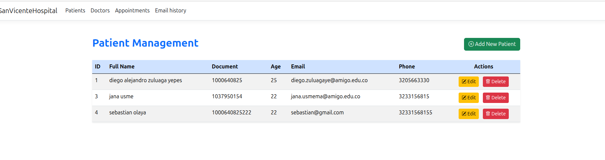
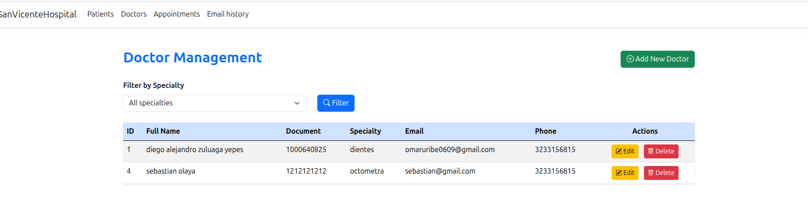
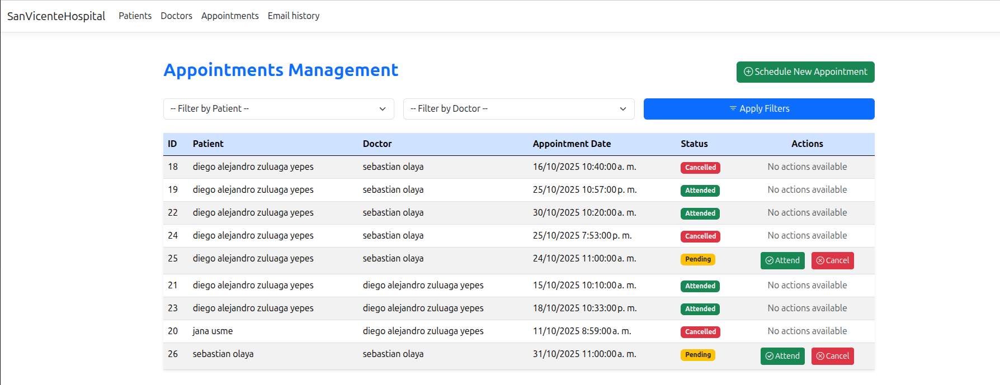
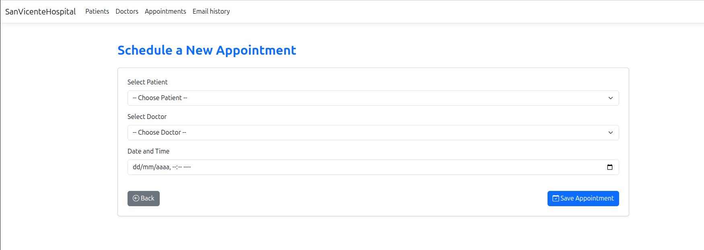
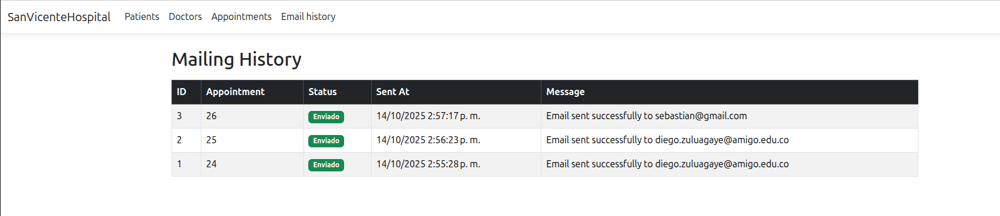
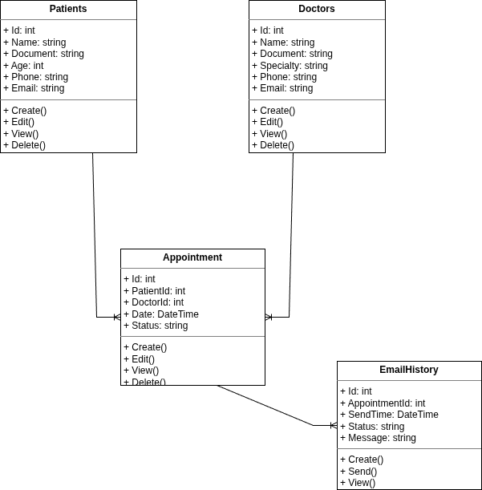
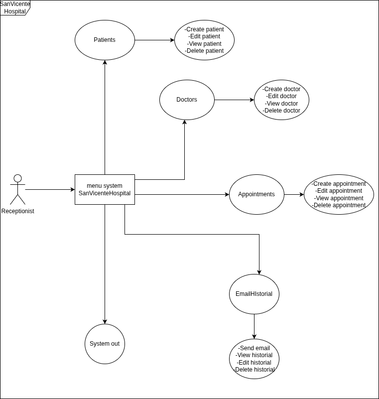

# San Vicente Hospital Management System

## Overview

San Vicente Hospital Management System is a **web-based hospital management application** built with **ASP.NET Core MVC**, **Entity Framework Core**, and **PostgreSQL**. The system allows managing **patients, doctors, medical appointments, and email notifications** with an intuitive and responsive interface.

**Key Features:**

* **Patients:** Add, edit, view, and delete patient records.
* **Doctors:** Add, edit, view, delete doctors; ensure unique name-specialty combinations.
* **Appointments:** Schedule appointments, avoid conflicts, cancel or mark as attended, filter by patient or doctor.
* **Email Notifications:** Automatic email confirmation for patients and history log with status (`Sent` / `Failed`).
* **Responsive UI:** Built with Bootstrap 5 for mobile and desktop devices.

---

## Prerequisites

Before running the project, ensure you have:

* [.NET 8 SDK](https://dotnet.microsoft.com/download/dotnet/8.0)
* PostgreSQL (version 15+)
* SMTP credentials (Gmail, Outlook, etc.) for email notifications
* Modern web browser (Chrome, Edge, Firefox)

#### NuGet Packages

To install required NuGet packages, run the following commands in the terminal inside your project folder:

```bash
# PostgreSQL provider for Entity Framework Core
dotnet add package Npgsql.EntityFrameworkCore.PostgreSQL

# MailKit for sending emails
dotnet add package MailKit
---

## Getting Started

### 1. Clone the repository

```bash
git clone https://github.com/alejo11102001/pruebaMVC
cd SanVicenteHospital
```

### 2. Configure the Database

Update your PostgreSQL connection string in `appsettings.json`:

```json
"ConnectionStrings": {
  "DefaultConnection": "Host=localhost;Database=SanVicenteHospital;Username=postgres;Password=yourpassword"
}
```

Apply database migrations:

```bash
dotnet ef database update
```

> This will create all necessary tables (`patients`, `doctors`, `appointments`, `emailHistory`).

---

### 3. Configure Email Settings

Add your SMTP credentials to `appsettings.json`:

```json
"EmailSettings": {
  "From": "your_email@example.com",
  "Password": "your_email_password",
  "SmtpServer": "smtp.gmail.com",
  "Port": 587
}
```

> For Gmail, use an **App Password** for security.

---

### 4. Run the Application

```bash
dotnet run
```

Open your browser:

```
https://localhost:5001
```

---

## Application Usage

### 1. Patients Management

**Add New Patient**



* Click **Add New Patient**
* Fill out the form
* Click **Save**

**Edit or Delete Patient**

* Click **Edit** or **Delete** on the patient row in the table.

---

### 2. Doctors Management

**Add Doctor with Unique Name & Specialty**



* Ensure no duplicate name-specialty exists.
* Edit or delete existing doctors.
* Filter doctors by **specialty** using the dropdown.

---

### 3. Appointments Management

**Schedule Appointment**



* Select **Patient** and **Doctor**
* Pick **Date & Time** (future only)
* Submit to schedule and send email

**Appointment Validation**

* Prevents scheduling conflicts for doctor or patient.
* Displays **error messages** directly in the Create form if conflicts occur.

**Cancel or Attend Appointment**



* Click **Cancel** to mark as cancelled.
* Click **Attend** to mark as attended.

**Filter Appointments**

* Filter by **Patient** or **Doctor** using dropdowns at the top of the table.

---

### 4. Email Notification History



* Automatically logs emails sent when appointments are scheduled.
* Shows **status** (`Sent` / `Failed`), **timestamp**, and **message content**.

---

## Developer Information

* **Name:** Diego Alejandro Zuluaga Yepes
* **Clan:** Van-Rossum
* **Email:** [diego.zuluagaye@amigo.edu.co](mailto:diego.zuluagaye@amigo.edu.co)
* **ID:** 1000640825

---

## Diagrams

* **Class Diagram:** 
* **Use Case Diagram:** 

## Deliverables

1. **GitHub Repository:** https://github.com/alejo11102001/pruebaMVC
2. **Compressed Project:** `SanVicenteHospital.zip`
3. **Class Diagram:** `wwwroot/clases.drawio.png`
4. **Use Case Diagram:** `wwwroot/casos.drawio.png`
5. **README.md** (this file, complete instructions included)

---

## Notes

* All appointments are stored in **UTC** in the database to prevent timezone issues.
* The system ensures **unique scheduling** for doctors and patients.
* Email logs allow administrators to track notification delivery.
